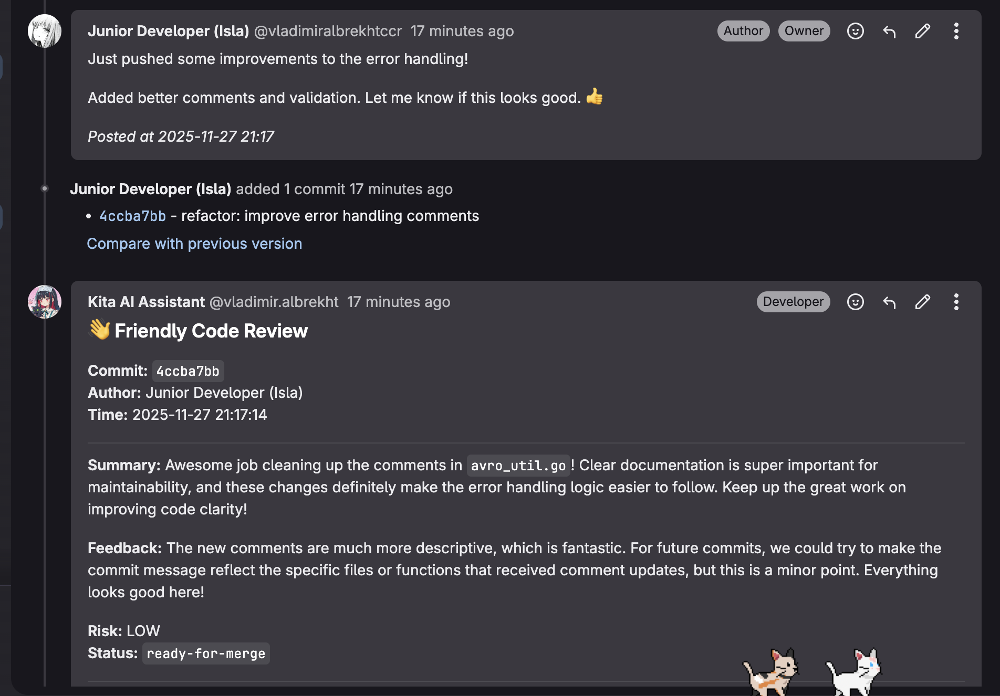

Project for Hackathon Kita AI assistant for track "AI-Code Review Assistant".

For this project we took real world bank related case from `https://github.com/confluentinc/confluent-kafka-go/pull/1493` where MR was merged. 

For that we "git cloned" repo then uploaded to `gitlab` and created new branch with commits from MR --> created new MR and finally used our solution to prove that it works.

We evaluated our model using our `Evaluation Pipeline`. 

1. First we created different scenarios that will be used for evaluation. You can check them in the folder: ``

2. Second Evaluation Pipeline based on those scenarios:
- creates new `MR`
- creates new `unit_tests`
- use our solution to solve the `MR`
- finally provides the amount of sucessful `MR` based on the amount of passed tests.

## Installation guide

1. Clone this repository
2. Install dependencies:
```bash
pip install -r requirements.txt
```
3. Set up environment variables:
```bash
cp .env.example .env
```

## Pipeline


How pipeline works:

1. New MR created.
2. Our **Senior Agent** receives `user_comments + diffs` --> and provides review with one of 3 labels.
3. Our **Suggestions Agent** receives `feedback_from_seniour_agent + diffs` --> and creates new suggestions for the code parts.
4. Finally everything is send via `GitLab api` to the repository.


### Instruction how to run it:

You will need to first connect the bot to GitLab repository, also make sure to specify the environment variables inside .env file.

1. Run webhook server for new MR `python real_world_case/1_webhook_for_new_mr.py`
2. Run webhook server for new commits `python real_world_case/2_webhook_for_new_commits.py`
3. Test by making a new MR using `python real_world_case/1_1_generation_of_new_MR.py`
4. Test by making a new commit using `python real_world_case/commit_simulator_from_junior.py`

After that you will be able to see the changes in the MR and commits in the GitLab repository with label by the Kita bot `reade-for-merge`.





## Evaluation pipeline

